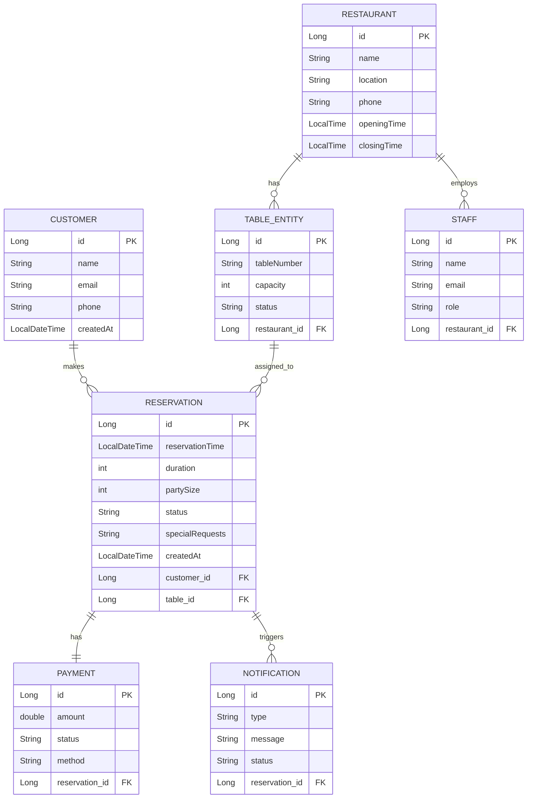

# Restaurant Reservation System Documentation

## 1. Overview

This document describes the design and functional specification of a Restaurant Reservation System built using Spring Boot. The system allows customers to book tables, restaurants to manage seating, and staff to oversee operations.

---

## 2. System Objectives

- Allow customers to reserve tables بسهولة
- Prevent double booking
- Optimize table allocation
- Support multiple restaurants
- Enable staff/admin management

---

## 3. System Architecture

The system follows an **Entity-Based Architecture**, where the core design revolves around domain entities and their relationships. Each entity represents a real-world concept, and business logic is built around these entities.

### Key Principles:

- Entities are the foundation of the system
- Each entity maps directly to a database table
- Relationships between entities drive system behavior
- Services operate on entities to enforce business rules

### Architectural Layers (Aligned with Entities):

- **Entity Layer**: Core domain objects (Customer, Reservation, TableEntity, etc.)
- **Repository Layer**: Handles database interaction for each entity
- **Service Layer**: Contains business logic operating on entities
- **Controller Layer**: Exposes APIs based on entity operations

### Flow:

Client → Controller → Service → Repository → Database

All operations (e.g., reservations, availability checks) are performed by manipulating and validating entities.

---

## 4. Entity Design

### 4.1 Customer

Represents users making reservations.

Fields:
- id
- name
- email
- phone
- createdAt

Relationships:
- One Customer → Many Reservations

---

### 4.2 Restaurant

Fields:
- id
- name
- location
- phone
- openingTime
- closingTime

Relationships:
- One Restaurant → Many Tables
- One Restaurant → Many Staff

---

### 4.3 TableEntity

Fields:
- id
- tableNumber
- capacity
- status
- restaurant_id

Relationships:
- Many Tables → One Restaurant
- One Table → Many Reservations

---

### 4.4 Reservation

Fields:
- id
- reservationTime
- duration
- partySize
- status
- specialRequests
- createdAt
- customer_id
- table_id

Relationships:
- Many Reservations → One Customer
- Many Reservations → One Table

---

### 4.5 Staff

Fields:
- id
- name
- email
- role
- restaurant_id

---

### 4.6 Payment (Optional)

Fields:
- id
- amount
- status
- method
- reservation_id

---

### 4.7 Notification (Optional)

Fields:
- id
- type
- message
- status
- reservation_id

---

## 5. ER Diagram

### 5.1 Visual ERD Diagram


### 5.2 Mermaid ERD (Code Version)



### 5.3 Textual Relationships

```
Customer 1 ─── * Reservation
Table    1 ─── * Reservation
Restaurant 1 ─── * Table
Restaurant 1 ─── * Staff
Reservation 1 ─── 1 Payment
Reservation 1 ─── * Notification
```

---

## 6. Functional Requirements

### 6.1 Customer Management
- Register
- Login
- Update profile
- View reservations

### 6.2 Restaurant Management
- Create restaurant
- Define working hours

### 6.3 Table Management
- Add/Edit/Delete tables
- Set capacity
- Update status

### 6.4 Reservation Management
- Create reservation
- Update reservation
- Cancel reservation
- View reservation

### 6.5 Availability Search
- Search by date/time
- Filter by party size
- Return available tables

### 6.6 Staff Management
- Manage system operations

### 6.7 Payment Handling
- Process payments
- Track payment status

### 6.8 Notifications
- Send booking confirmations
- Send reminders

---

## 7. Business Rules

- No double booking
- Reservation must fit table capacity
- Reservations must be within opening hours
- Each reservation belongs to one customer and one table

---

## 8. Reservation Logic

### Overlap Rule

Two reservations overlap if:

start1 < end2 AND start2 < end1

---

## 9. API Design

### Reservation Endpoints

- POST /reservations
- GET /reservations/{id}
- DELETE /reservations/{id}
- GET /availability

---

## 10. Non-Functional Requirements

- Scalability
- Reliability
- Security (JWT Authentication)
- Performance (Indexed queries)

---

## 11. Future Enhancements

- Waitlist system
- AI table optimization
- Analytics dashboard
- Mobile app integration

---

## 12. Bounded Contexts (Domain-Driven Design)

To improve scalability and maintainability, the system is restructured into **bounded contexts**. Each context owns its data, logic, and APIs, and communicates with others via well-defined contracts.

### 12.1 User Context

**Purpose:** Manage customers and authentication.

**Entities:**
- Customer

**Responsibilities:**
- Registration & authentication (JWT)
- Profile management
- View reservation history (via Reservation Context APIs)

**APIs:**
- POST /users/register
- POST /users/login
- GET /users/{id}

---

### 12.2 Restaurant Context

**Purpose:** Manage restaurants, tables, and staff.

**Entities:**
- Restaurant
- TableEntity
- Staff

**Responsibilities:**
- CRUD for restaurants
- Table configuration (capacity, status)
- Staff management
- Define opening hours

**APIs:**
- POST /restaurants
- GET /restaurants/{id}
- POST /tables
- PATCH /tables/{id}

---

### 12.3 Reservation Context (Core Domain)

**Purpose:** Handle booking lifecycle and availability.

**Entities:**
- Reservation

**Collaborators (read-only or via API):**
- TableEntity (from Restaurant Context)
- Customer (from User Context)

**Responsibilities:**
- Create/update/cancel reservations
- Availability checks
- Table allocation
- Enforce business rules (no overlap, capacity)

**APIs:**
- POST /reservations
- GET /reservations/{id}
- DELETE /reservations/{id}
- GET /availability

**Core Rule:**
- Overlap detection: start1 < end2 AND start2 < end1

---

### 12.4 Payment Context (Optional)

**Purpose:** Handle financial transactions.

**Entities:**
- Payment

**Responsibilities:**
- Process payments (Card, Mobile Money)
- Track payment status
- Link payment to reservation

**APIs:**
- POST /payments
- GET /payments/{reservationId}

---

### 12.5 Notification Context

**Purpose:** Manage communications with users.

**Entities:**
- Notification

**Responsibilities:**
- Send confirmations
- Send reminders
- Track delivery status

**APIs:**
- POST /notifications/send

---

## 13. Context Interaction

Contexts should communicate via **REST APIs or events**, not direct database access.

### Example Flow (Reservation Creation):

1. User Context authenticates customer
2. Reservation Context receives booking request
3. Reservation Context queries Restaurant Context for available tables
4. Reservation Context creates reservation
5. Notification Context sends confirmation
6. Payment Context processes payment (if required)

---

## 14. Benefits of Bounded Contexts

- Clear separation of concerns
- Independent scalability
- Easier testing and maintenance
- Enables microservices migration in the future

---

## 15. Conclusion

This system uses an entity-based design enhanced with bounded contexts to provide a scalable, maintainable, and production-ready restaurant reservation platform using Spring Boot.

